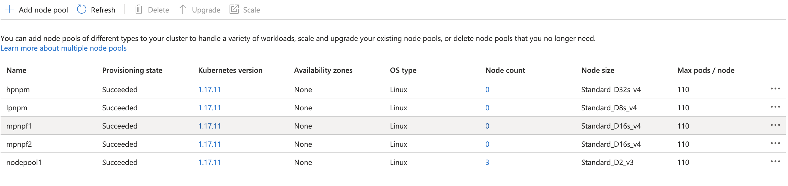

# AKS: how to bill your internal cluster tenants when a tenant doesn't require a separate cluster

When it comes to paying a bill, you probably always want to know who consumed what. It is easy in Azure to tag all resources a department use and to get a vision on expenditure. But when it comes to an AKS cluster, which is shared, it might be an issue.

Of course, the easiest way is to create a cluster per department, add all necessary tags, and get a report in the Cost Analysis of the Cost Management + Billing section. But what to do when a department doesn't need a whole cluster all the time. Of course, you can automate a cluster creation on request with Azure DevOps + IaC of your taste (Terraform, Ansible, ARM). However, this takes time to automate + time for the cluster to be up and running.

As an alternative solution, you want to have a cluster for shared tenants that don't run workloads all the time. As an example, you can consider your departments of Finance, Marketing, etc. These departments can run their workloads on a shared cluster and you can bill them separately for the resources they have consumed. This can significantly lower the associated costs, such as cluster management, automation, etc. So, there are several ways you can bill your tenants for the resources they have consumed.

## Azure Native Solution

The easiest way to solve the problem might be a "pool-per-department/pools-per-department' solution. You can create a pool(s) with proper tags in place for each department with autoscale enabled(optional) and schedule resources to this pool(s). Later, in Cost Analysis of the Cost Management + Billing section, you can add a filter `Tag:poolname:<department_pool_name>` and `Tag:kubernetes.io-created-for-pvc:<deployment_name>` and  get the costs a department has generated.

#### Pros of this approach

* Native out-of-box Azure solution.
* 'Pay-as-you-go' with nodepool autoscale. Initially, you can keep a 0-node size pool. Once a deployment has been submitted, the schedule will accept it and the cloud-controller will start adding a node to host a deployment. 0-node pool size is a feature, that has been released recently.
* One place for all your cost analysis.
  
#### Cons

* You need to pick the right size for the nodes to host your deployments or create multiple nodepools of a different VM shapes

#### Useful links

* Node labels as part of agentPoolProfile – https://github.com/Azure/AKS/issues/1088, https://docs.microsoft.com/en-us/azure/aks/use-multiple-node-pools#setting-nodepool-labels
* Node tags – https://docs.microsoft.com/en-us/azure/aks/use-multiple-node-pools#setting-nodepool-azure-tags
* Auto scaling support min count zero – https://github.com/Azure/AKS/issues/1565

And Always keep an eye on AKS Roadmap – https://github.com/Azure/AKS

## Kubecost

Another way to bill your tenants for the resources they have used is to leverage 3rd party solution – Kubecost.

https://kubecost.com/

Leveraging this solution, you can create a namespace for each department or calculate the costs using K8s labels.

#### Pros of this solution

* Free plan is available.
* Namespace/label/etc based approach. No need to assign pods to a particular node.
* Less number of nodepools (or even one nodepool (virtual kubelet) will do) to cover the deployments of all tenants.
* Reporting. Kubecost allows you to get reports based on a variety of filters.

#### Cons

* Free plan allows you to have only one cluster and limited in features.
* 3rd party solution that requires extra management: installation, updates, etc.
* Extra costs if you want to have all features available

## Hands-on experience

In the next lab, we'll create a cluster with both tags attached and Kubecost installed. So, you can check both ways and pick one that covers your need the best.

#### 1. Create a Resource Group

https://docs.microsoft.com/en-us/cli/azure/group?view=azure-cli-latest#az_group_create

```bash
az group create --location westeurope --name aks-shared
```

#### 2. Create AKS cluster and download kubeconfig
https://docs.microsoft.com/en-us/cli/azure/aks?view=azure-cli-latest#az_aks_create

```bash
az aks create \
--name aks-shared-cluster-1 \
--resource-group aks-shared \
--location westeurope \
--network-plugin kubenet \
--node-count 3 \
--node-vm-size "Standard_D2_v3"
```

```bash
az aks get-credentials -n aks-shared-cluster-1 -g aks-shared -f ./kubeconfig

export KUBECONFIG=./kubeconfig
```

#### 3. Install KubeCost

https://kubecost.com/
https://kubecost.com/install

There is a free tier that can cover one cluster without cluster size limit.

#### 4. Add nodepools

https://docs.microsoft.com/en-us/cli/azure/ext/aks-preview/aks/nodepool?view=azure-cli-latest#ext_aks_preview_az_aks_nodepool_add

##### High Performance Node Pool for Marketing

```bash
az aks nodepool add \
--cluster-name aks-shared-cluster-1 \
--resource-group aks-shared \
--name hpnpm \
--labels performance=high department=marketing \
--tags department=marketing costcenter=9999  performance=high \
--enable-cluster-autoscaler \
--node-vm-size "Standard_D32s_v4" \
--min-count 0 \
--max-count 10 \
--node-count 0
```

##### Low Performance Node Pool for Marketing

```bash
az aks nodepool add \
--cluster-name aks-shared-cluster-1 \
--resource-group aks-shared \
--name lpnpm \
--labels performance=low department=marketing \
--tags department=marketing costcenter=9999 performance=low \
--enable-cluster-autoscaler \
--node-vm-size "Standard_D8s_v4" \
--min-count 0 \
--max-count 10 \
--node-count 0
```

##### Kubecost pool – Medium Performance Node Pool 1

```bash
az aks nodepool add \
--cluster-name aks-shared-cluster-1 \
--resource-group aks-shared \
--name mpnpf1 \
--labels performance=medium kubecost=true \
--tags department=other costcenter=0000 \
--enable-cluster-autoscaler \
--node-vm-size "Standard_D16s_v4" \
--min-count 0 \
--max-count 10 \
--node-count 0
```

##### Kubecost pool – Medium Performance Node Pool 2

```bash
az aks nodepool add \
--cluster-name aks-shared-cluster-1 \
--resource-group aks-shared \
--name mpnpf2 \
--labels performance=medium kubecost=true \
--tags department=other costcenter=0000 \
--enable-cluster-autoscaler \
--node-vm-size "Standard_D16s_v4" \
--min-count 0 \
--max-count 10 \
--node-count 0
```



#### 5. Create Workload Deployment for the Marketing department

We'll schedule it to the node with medium performance. This deployment just burns the CPU and memory. It is used as an example only.

```yml
---
apiVersion: v1
kind: Namespace
metadata:
  name: marketing-research-333
---
apiVersion: apps/v1
kind: Deployment
metadata:
  name: stress
  namespace: marketing-research-333
  labels:
    app: stress
spec:
  replicas: 10
  selector:
    matchLabels:
        app: stress
  template:
    metadata:
      labels:
        app: stress
    spec:
      containers:
      - name: stress
        image: progrium/stress
        imagePullPolicy: Always
        args: ["--cpu", "1", "--timeout", "100000s", "--io", "1", "--vm", "2", "--vm-bytes", "128M"]
      nodeSelector:
        performance: "high"
        department: "marketing"
```

#### 6. Create Workload Deployment for the Finance department

We'll land it to one of the 2 nodes we have labeled with `kubecost=true` to cover 2 approaches in one lab. This deployment just burns the CPU and memory. It is used as an example only.

```yml
---
apiVersion: v1
kind: Namespace
metadata:
  name: finance-report-222
---
apiVersion: apps/v1
kind: Deployment
metadata:
  name: stress
  namespace: finance-report-222
  labels:
    app: stress
spec:
  replicas: 50
  selector:
    matchLabels:
        app: stress
  template:
    metadata:
      labels:
        app: stress
    spec:
      containers:
      - name: stress
        image: progrium/stress
        imagePullPolicy: Always
        args: ["--cpu", "1", "--timeout", "100000s", "--io", "1", "--vm", "2", "--vm-bytes", "128M"]
      nodeSelector:
        kubecost: "true"
```

It will take some time before nodepool will scale to host deployments.


#### 7. Azure Cost Analysis

In the Azure portal Cost analysis section, by adding filters "Tag + poolname + marketing" you can get the costs for a particular time period for a noodepool.


Also, you can add/or costs for storage


#### 8. Kubecost

* Run port-forwarder (or you can create a service) to reach Kubecost Dashboard

```bash
kubectl port-forward --namespace kubecost deployment/kubecost-cost-analyzer 9090
```

* Open `http://127.0.0.1:9090` in your browser and go to the Reports section
* Observe the results


## Conclusions

Each method of billing your tenants has it's own pros and cons. With Kubecost, it is easy to sum up precisely all the costs a tenant has spent. But, it requires some extra efforts to add costs associated costs such as idle resources (underutilized nodes, etc.). So, all in all, it gonna be pretty much the same with tagging the nodepools using Azure native approach.
Anyway, now you can bill your internal tenants based on the amount of resources they have consumed.

Good Luck!
